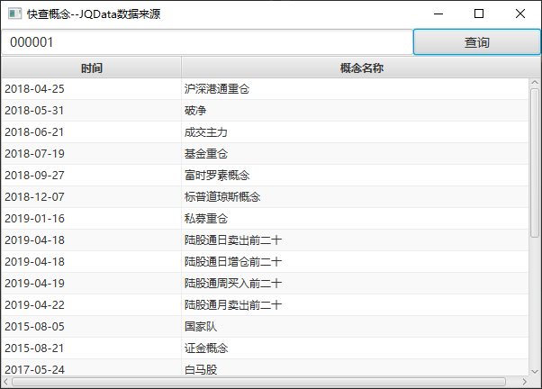

### 编译

``mvn install``

### 运行
``java -jar SearchConcept.jar``

### 输入框支持命令

- `CLEAR` 清空表数据

- `REFRESH` 刷新数据库中概念数据（单进程界面会卡顿）

- 刷新后直接输入0，3，6开头股票代码即可查询

### 目录

|路径|文件|
|:---:|:---:|
|`config/*`|token配置|
|`database/*`|数据库文件|

### 界面

